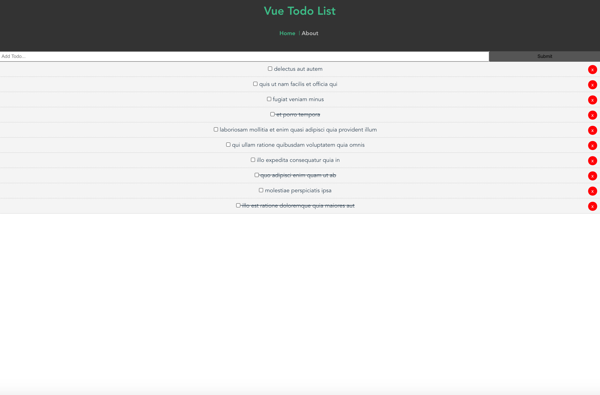

# Vue To-Do List

This is the first project I've built using Vue.js and Vue CLI. I wanted to make a basic CRUD application
and am currently fetching the list of To-Do's by making an API call to https://jsonplaceholder.typicode.com/ and loading what you see on initial start. I made it possible to add and remove To Do's on the list and enjoyed the experience of learning Vue.js.

## Project setup
```
npm install
```

### Compiles and hot-reloads for development
```
npm run serve
```

### Compiles and minifies for production
```
npm run build
```

### Lints and fixes files
```
npm run lint
```

### Customize configuration
See [Configuration Reference](https://cli.vuejs.org/config/).
